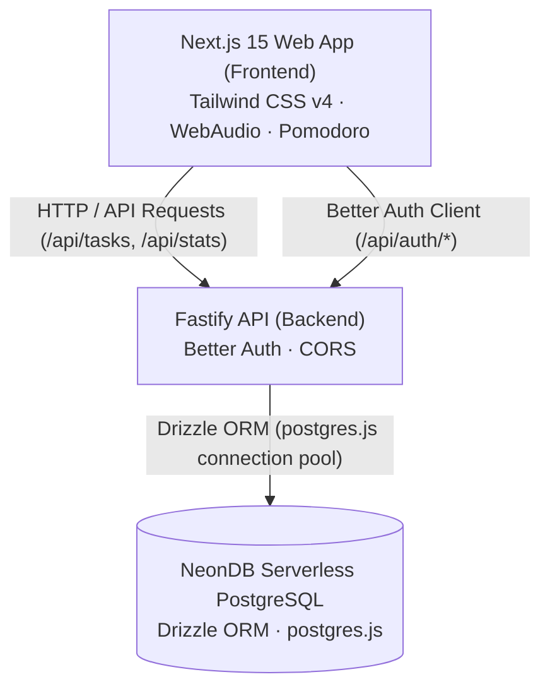

# System Architecture

Dayzeros is organized as a high-performance full-stack **Monorepo** dividing concerns between a client-facing web application and an API backend.



---

## Workspaces Overview

### 1. `frontend/` (Next.js 15 App Router)
- **Framework**: Next.js 15 (React 19, TypeScript).
- **Styling**: Tailwind CSS v4 with custom color tokens (`@theme`), Playfair Display, Space Grotesk, and Space Mono fonts.
- **Audio Engine**: Synthesizes rain, crickets (LFO-modulated bandpass filter), and wind procedurally using the WebAudio API.
- **Timer Engine**: 25/5 Pomodoro interval state machine with automatic break rolling and session progress.
- **Authentication**: `better-auth/react` client managing sessions and route protection.

### 2. `backend/` (Fastify API)
- **Framework**: Fastify with TypeScript (ES modules).
- **Database Driver**: `postgres` (postgres.js) with SSL enabled for NeonDB.
- **ORM**: Drizzle ORM (`drizzle-orm`, `drizzle-kit`).
- **Auth Provider**: Better Auth (`better-auth`) with Drizzle adapter.
- **Endpoints**:
  - `/api/auth/*`: Better Auth session, sign in, sign up, sign out.
  - `/api/tasks`: Authenticated CRUD operations for user tasks.
  - `/api/stats`: Authenticated daily focus minutes, session banking, streaks, and preferences.

---

## Directory Structure

```
dayzeros-monorepo/
├── backend/
│   ├── src/
│   │   ├── auth.ts            # Better Auth configuration
│   │   ├── db/
│   │   │   ├── index.ts       # postgres.js + Drizzle client
│   │   │   └── schema.ts      # Drizzle tables definition
│   │   ├── routes/
│   │   │   ├── tasks.ts       # Task management endpoints
│   │   │   └── stats.ts       # Focus statistics & preferences
│   │   └── index.ts           # Fastify server entrypoint
│   ├── drizzle.config.ts      # Drizzle kit configuration
│   └── package.json
│
├── frontend/
│   ├── src/
│   │   ├── app/               # Next.js App Router pages
│   │   ├── components/        # UI components (FocusView, SpaceView, AuthModal, etc.)
│   │   ├── context/           # DayzerosContext & state management
│   │   ├── hooks/             # WebAudio, Pomodoro, and Keyboard hooks
│   │   └── lib/               # Better Auth client & typed API client
│   ├── public/assets/         # Pixel-art meadow artwork
│   └── package.json
│
├── docs/                      # Technical documentation
├── .env.example               # Environment variables template
├── AGENTS.md                  # Agent operating instructions
├── CHANGELOG.md               # Version history
└── package.json               # Root monorepo workspace scripts
```
