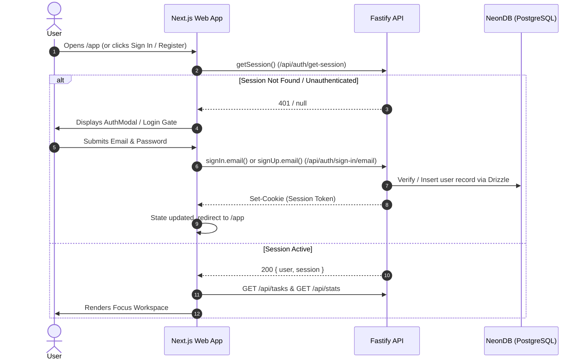

# Authentication Guide

Dayzeros uses **Better Auth** with the **Drizzle ORM** adapter for authentication.

---

## Authentication Flow



---

## Better Auth Server Configuration (`backend/src/auth.ts`)

```typescript
import { betterAuth } from 'better-auth';
import { drizzleAdapter } from 'better-auth/adapters/drizzle';
import { db, schema } from './db/index.js';

export const auth = betterAuth({
  database: drizzleAdapter(db, {
    provider: 'pg',
    schema: {
      user: schema.user,
      session: schema.session,
      account: schema.account,
      verification: schema.verification,
    },
  }),
  emailAndPassword: {
    enabled: true,
  },
  trustedOrigins: [
    process.env.FRONTEND_URL || 'http://localhost:3000',
    'http://localhost:3000',
  ],
  secret: process.env.BETTER_AUTH_SECRET,
  baseURL: process.env.BETTER_AUTH_URL || 'http://localhost:4000',
});
```

---

## Better Auth Client Usage (`frontend/src/lib/auth-client.ts`)

```typescript
import { createAuthClient } from 'better-auth/react';

export const authClient = createAuthClient({
  baseURL: process.env.NEXT_PUBLIC_API_URL || 'http://localhost:4000',
});

export const { signIn, signUp, signOut, useSession, getSession } = authClient;
```

### In React Components:
```tsx
const { data: session, isPending } = useSession();

// Sign in:
await signIn.email({ email, password });

// Sign up:
await signUp.email({ name, email, password });

// Sign out:
await signOut();
```

---

## Route Protection & Guards
- The focus workspace (`/app`, `/focus`, `/planner`) is strictly protected.
- If an unauthenticated user attempts to access these routes, `AppWorkspace.tsx` triggers the `AuthModal` dialog and prevents unauthenticated data manipulation.
